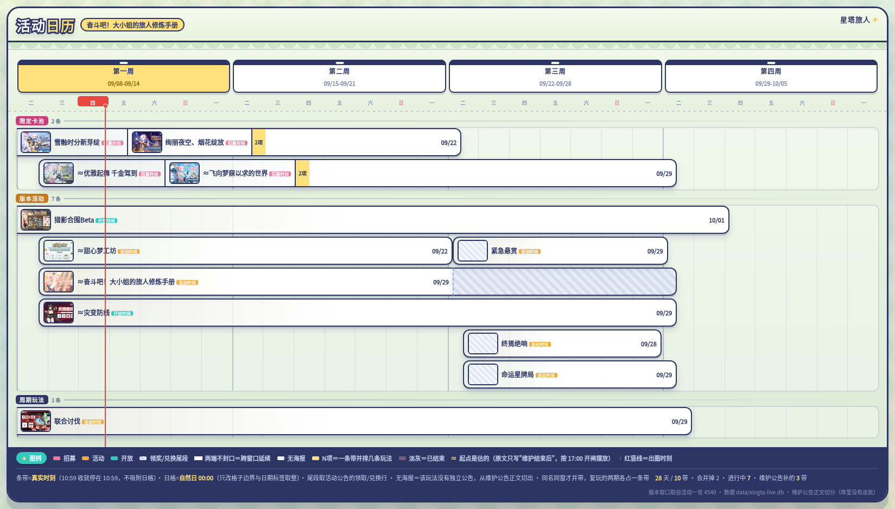

# 星塔机器人 (StellasoraBot)

《星塔旅人》官方活动日历与提醒 QQ 机器人。

自动抓取并解析《星塔旅人》官方网站公告，提供实时活动进度查询、到期提醒推送，并支持一键生成全彩版本活动日历长图海报。

---

## 核心功能

- **版本活动日历海报**：一键生成当期版本的全局时间轴日历长图，展示限定卡池、大版本活动、周期玩法及精确时刻标记，自动拉取官方封面封绘并匹配主题底色。
- **多维活动查询**：支持查询当前进行中活动、即将到期活动及后续开启活动，排版清晰规范，秒级响应。
- **活动到期提醒**：在活动结束前（默认提前 48 小时）自动扫描并在群聊或私聊中发送提醒，避免遗漏奖励。
- **QQ 官方指令面板集成**：对接腾讯 QQ 开放平台 API-v2，在聊天输入框键入 `/` 即可唤起官方原生交互菜单。
- **数据订正与人工介入**：针对官方临时维护改口或特殊活动，提供完整的管理员指令（查看待确认、时间覆盖、隐藏/显示）。
- **轻量低功耗常驻**：纯 Go 编写，已深度适配 Android (Termux) 手机环境与 Linux 服务器，无需复杂依赖，可常驻后台低功耗运行。

---

## 日历海报效果展示

发送 `/calendar` 后，机器人调用无头渲染引擎生成的版本活动日历长图海报效果如下（包含四周版本跨度视图、今日时刻红线标记、全彩官方封面封绘及活动类型标牌）：



---

## 指令列表

### 1. 公开指令

群成员与私聊均可直接使用。支持在聊天框输入 `/` 唤起菜单点击，或直接发送指令（如 `/calendar` 或 `@机器人 /calendar`）：

| 指令 | 说明 | 示例返回内容 |
| :--- | :--- | :--- |
| `/calendar` | **版本活动日历** | 发送高清版本活动日历长图海报，带全量活动封绘与时间进度轴 |
| `/events` | **当前进行中活动** | 列出当前所有正在开放的活动、限定招募、周期玩法及剩余时间 |
| `/ending` | **即将结束的活动** | 列出未来 48 小时内即将截止的活动，提醒玩家及时兑换奖励 |
| `/upcoming` | **即将开启的活动** | 列出已在公告公布、但尚未开启的新版本内容与预热卡池 |
| `/help` | **指令帮助** | 查看机器人使用说明与全部支持的命令菜单 |

### 2. 管理员指令

仅限群主、管理员或白名单配置用户使用，用于维护日历准确性：

| 指令 | 格式 | 说明 |
| :--- | :--- | :--- |
| `/review` | `/review` | 查看当前尚未自动识别、或待人工复核的公告条目 |
| `/override` | `/override <活动ID> <开始时间> <结束时间> [标题]` | 强制修正指定活动的时间窗口（应对官方临时维护改口） |
| `/confirm` | `/confirm <活动ID>` | 确认人工核验通过，转为正式日历条目 |
| `/hide` | `/hide <活动ID>` | 在日历与查询列表中隐藏该条目（如测试公告、已作废内容） |
| `/show` | `/show <活动ID>` | 重新公开并显示被隐藏的活动条目 |

---

## 快速上手

### 1. 准备凭据

在项目根目录新建 `creds.json`（已在 `.gitignore` 中排除，请勿提交公开）：

```json
{
  "appId": "你的QQ机器人AppID",
  "clientSecret": "你的QQ机器人AppSecret"
}
```

### 2. 注册 QQ 官方指令菜单面板（可选）

运行内置工具，将公开指令一键提交至腾讯开放平台审核：

```bash
go run ./cmd/panelreg -creds creds.json
```

### 3. 启动运行

#### 方式 A：标准本地运行

```bash
# 纯文本模式（无需浏览器内核，内存占用极低）
go run ./cmd/xingtabot -creds creds.json -db data/xingta.db

# 启用日历出图模式（需指定系统已有的 Chrome / Chromium 可执行文件路径）
go run ./cmd/xingtabot -creds creds.json -db data/xingta.db -chrome "C:/Program Files/Google/Chrome/Application/chrome.exe"
```

#### 方式 B：Android 手机 (Termux) 后台常驻

项目针对 Android Termux 环境进行了专项适配（内置 DNS 优化、字体挂载及无沙箱环境兼容），并提供了开箱即用的后台管理脚本：

```bash
cd ~/xingtabot

# 启动（screen 后台守护运行）
./start.sh

# 查看当前运行状态与日志
./status.sh

# 持续跟踪日志输出
./logs.sh

# 安全停止
./stop.sh
```

---

## 开源许可证

本项目基于 MIT License 协议开源。