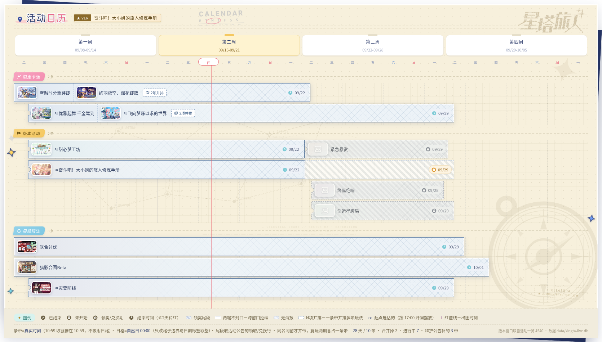
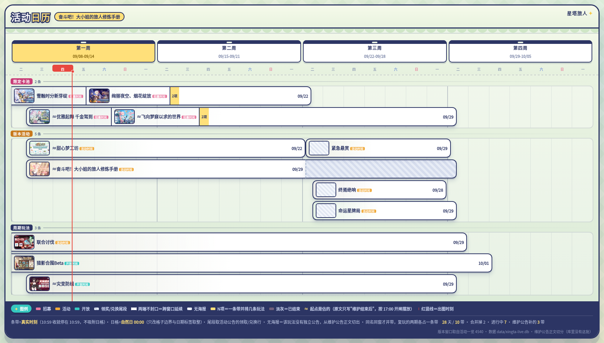
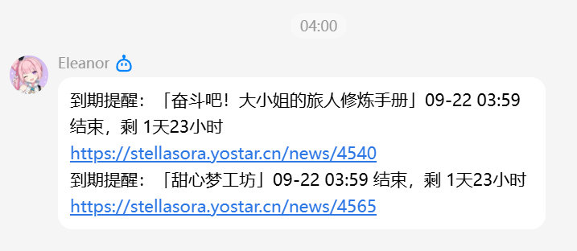
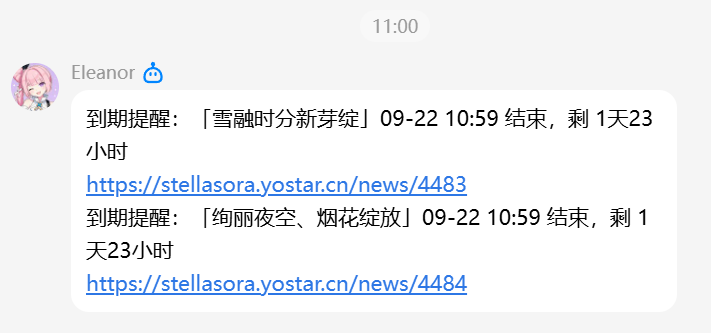

# 星塔机器人 (StellasoraBot)

[](https://github.com/419bw/stellasoraBot/actions/workflows/ci.yml)

《星塔旅人》官方活动日历、到期提醒与 B站动态推送 QQ 机器人。

自动抓取并解析《星塔旅人》官方网站公告与官方 B站动态，提供实时活动进度查询、到期提醒推送，并支持一键生成全彩版本活动日历长图海报与动态卡片。

---

## 核心功能

- **版本活动日历**：一键生成当期版本时间轴长图海报，带官方封绘、卡池周期与今日进度红线。
- **B站动态推送**：自动轮询官方 B站动态，高保真渲染富文本与多图卡片秒级推送入群。
- **活动到期提醒**：活动结束前自动预警（默认提前 48 小时），避免遗漏限时奖励。
- **多维活动查询**：支持快捷查询进行中 (`/events`)、即将结束 (`/ending`) 及未来开启 (`/upcoming`) 的活动。
- **多主题订阅管理**：群管可按需独立开启/关闭各主题推送（`/push`），支持公告临时调整的人工订正。
- **超轻量低功耗**：纯 Go 编写，常驻物理内存仅 **8~10 MB**，深度适配 Android (Termux) 与 Linux 服务器。

---

## 效果展示

### 1. 版本活动日历海报 (`/calendar`)

发送 `/calendar` 后，机器人调用无头渲染引擎生成的版本活动日历长图海报：

- **全新 V2 版本**（包含罗盘暗纹水印、稀疏星座航线图背景、临期状态标识与自适应封绘）：



- **V1 基础版本**：



### 2. B站官方动态推送卡片 (`biliwatch`)

官方 B站账号发布新动态时，机器人自动渲染并推送到群内的高保真动态长图卡片（包含富文本排版、话题标签、表情包混排与自适应多图布局）：


### 3. 活动到期提醒推送 (`calexpiry`)

活动截止前（默认提前 48 小时），机器人自动扫描临期活动并推送到群聊，附带精确截止时刻、剩余时间与官网公告直达链接：





---

## 指令列表

### 1. 公开指令

群成员与私聊均可直接使用。支持在聊天框输入 `/` 唤起菜单点击，或直接发送指令（如 `/calendar` 或 `@机器人 /calendar`）：

| 指令 | 说明 | 示例返回内容 |
| :--- | :--- | :--- |
| `/calendar` | **版本活动日历** | 发送高清版本活动日历长图海报，带全量活动封绘与时间进度轴 |
| `/events` | **当前进行中活动** | 列出当前所有正在开放的活动、限定招募、周期玩法及剩余时间 |
| `/ending` | **即将结束的活动** | 列出未来 48 小时内即将截止的活动，提醒玩家及时兑换奖励 |
| `/upcoming` | **即将开启的活动** | 列出已在公告公布、但尚未开启的新版本内容与预热卡池 |
| `/push` | **查看群推送状态** | 查看本群主动推送总开关以及各功能主题（到期提醒/日历海报/B站动态）订阅状态 |
| `/help` | **指令帮助** | 查看机器人使用说明与全部支持的命令菜单 |

### 2. 管理员指令

仅限群主、管理员或白名单配置用户使用，用于维护日历与推送开关：

| 指令 | 格式 | 说明 |
| :--- | :--- | :--- |
| `/push on/off` | `/push on [all\|功能]`<br>`/push off [all\|功能]` | 独立开启或关闭本群主动推送（功能可选：`expiry` 到期提醒、`poster` 日历海报、`bili` B站动态） |
| `/review` | `/review` | 查看当前尚未自动识别、或待人工复核的公告条目 |
| `/override` | `/override <活动ID> <开始时间> <结束时间> [标题]` | 强制修正指定活动的时间窗口（应对官方临时维护改口） |
| `/confirm` | `/confirm <活动ID>` | 确认人工核验通过，转为正式日历条目 |
| `/hide` | `/hide <活动ID>` | 在日历与查询列表中隐藏该条目（如测试公告、已作废内容） |
| `/show` | `/show <活动ID>` | 重新公开并显示被隐藏的活动条目 |

---

## 快速上手

### 1. 准备凭据

在项目根目录新建 `creds.json`（已在 `.gitignore` 中排除，请勿提交公开）：

```json
{
  "appId": "你的QQ机器人AppID",
  "clientSecret": "你的QQ机器人AppSecret",
  "biliCookie": "可选，你的B站账号 Cookie（如 SESSDATA 等，大幅降低动态轮询风控；留空则使用匿名访客模式）"
}
```

### 2. 注册 QQ 官方指令菜单面板（可选）

运行内置工具，将公开指令一键提交至腾讯开放平台审核：

```bash
go run ./cmd/panelreg -creds creds.json
```

### 3. 启动运行

可调参数全部从配置文件读，命令行只剩一个参数——总配置文件放哪（默认 `config.yml`）：

```bash
# 直接跑：机器级参数（凭据路径、数据库、浏览器、时区、两个域名）读 config.yml，
# 各功能的参数读它自己那份 config/<功能>.yml
go run ./cmd/xingtabot

# 本机想用另一套路径（凭据放 .probe/、浏览器是 Windows 上装的 Chrome）：
# 拷一份改了再指过去。.probe/ 已被 .gitignore 排除，不会误提交
cp config.yml .probe/config.local.yml
go run ./cmd/xingtabot -config .probe/config.local.yml
```

**仓库里那份 `config.yml` 保持的是手机部署的值**（`creds.json`、`data/xingta.db`、
`./chrome-headless`），所以传上手机后二进制不带任何参数就能起；本机要跑就把 `chrome`
那一行改成自己的浏览器路径，`chrome: ""` 则是纯文本模式（不出图，查询与到期提醒照常——
这种情况下 `config/calposter.yml` 与 `config/biliwatch.yml` 连存在都不要求）。

一共七份文件：`config.yml` 管机器（凭据在哪、库在哪、用哪个浏览器、哪个时区），
`config/` 下每个功能一份（`annsync` 同步节奏、`calposter` 出图与推送、`calexpiry` 提醒
窗口、`calquery` 查询口径、`calops` 运维分页、`biliwatch` 监听谁、隔多久）。
**这些参数在代码里没有默认值可退了**：文件是唯一源，少一个键、值写成空、键名拼错
一律启动失败并点名，不会静默拿某个默认值跑起来。

每个值旁边都写了一句它管什么、改坏了会怎样；改完不用重编，重启进程即生效。启动时进程会把
真正吃进去的每个值连注释逐行打一遍（`config.tz = +08:00｜公告日期…`），"配置文件跟代码
是不是分家了"看这几行就能判断。

#### Android 手机 (Termux) 后台常驻

项目针对 Android Termux 环境进行了专项适配（内置 DNS 优化、字体挂载及无沙箱环境兼容），GitHub Actions 每次提交均会自动打包发布包含二进制、config.yml 及完整 config/ 目录的发布产物包（ARM64 与 AMD64），升级时解压覆盖即可同批更新。同时提供了后台管理脚本：

升级时建议解压产物包覆盖，确保二进制与配置文件同批更新。传完执行 ./stop.sh 优雅停止（发送 SIGTERM 触发 bbolt 安全落盘），再执行 ./start.sh 启动。

```bash
cd ~/xingtabot

# 启动（screen 后台守护运行；参数在 config.yml 里，命令行不再传）
./start.sh

# 查看当前运行状态与日志
./status.sh

# 持续跟踪日志输出
./logs.sh

# 安全停止
./stop.sh
```

---

## 开源许可证

本项目基于 MIT License 协议开源。